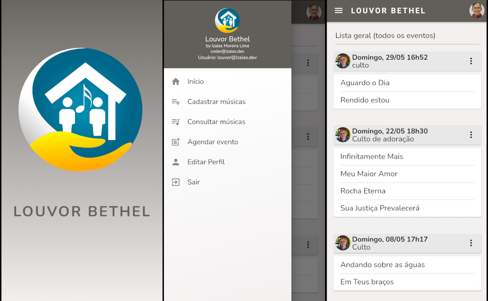

# Louvor Bethel

Este aplicativo se propõe ser a ferramenta de gestão das apresentações, dos ensaios e das partituras e letras (lyrics) das músicas da equipe de louvor de nossa comunidade cristã.

Provavelmente, este aplicativo não será publicado na Play Store por ser muito específico e estar acessando uma base de dados restrita. Assim, caso ele atenda você em alguma de suas necessidades ou sirva de modelo/inspiração para uma solução similar, sugiro que faça um *fork* deste projeto. 

## Prévia das telas

## Lista de recursos:

- interface simplificada
- uso off-line (usa internet, se desejar assistir clips das músicas)
- cadastro de letras/cifras em PDF
- cadastro de clips das músicas
- cadastro de equipe de louvor
- cadastro de eventos, com lista de músicas
- escalar a equipe de louvor em suas atribuições
- rolagem das letras na tela, com controle de velocidade
- exibir vídeos dos clips musicais

## Por onde começar

Este projeto é um aplicativo Flutter não trivial, já que usa autenticação e persistência de dados do Firebase. Então, se você for um iniciante como eu, aqui estão alguns recursos por onde você pode começar seus primeiros contatos com o Flutter:

- [Lab: Escreva sua primeira aplicação em Flutter](https://flutter.dev/docs/get-started/codelab)
- [Cookbook: Exemplos úteis em Flutter](https://flutter.dev/docs/cookbook)
- [Firebase: Documentação oficial](https://firebase.google.com/docs)

Para obter ajuda para começar a usar o Flutter, consulte a
[Documentação on-line](https://flutter.dev/docs), que oferece tutoriais, exemplos, orientação sobre desenvolvimento móvel e uma referência completa da API.
